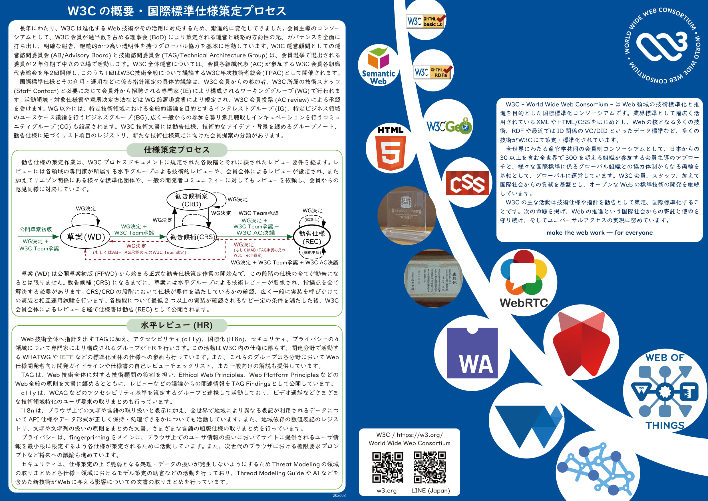
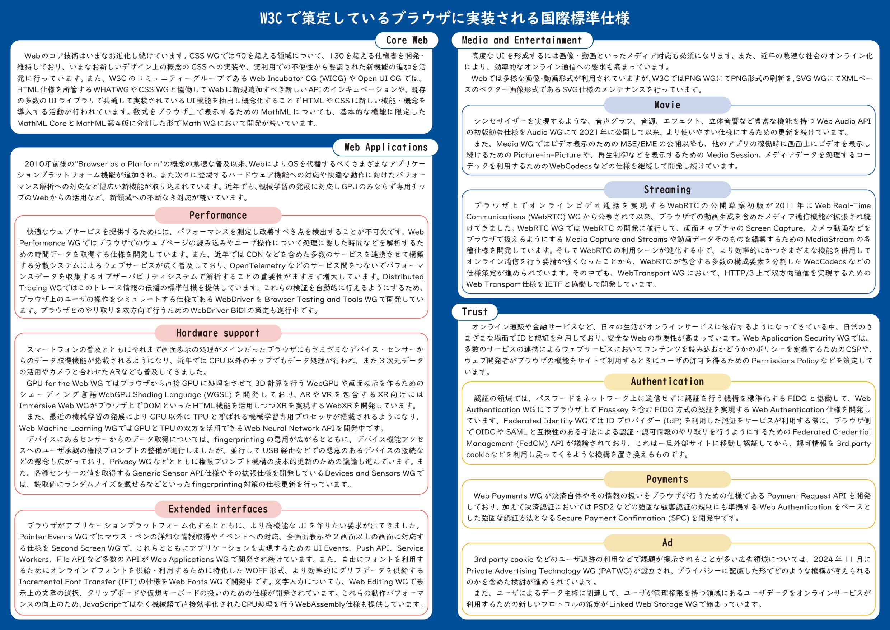

# W3C日本語版リーフレット

現在、A3版(A4二つ折り)のウェブ技術のリーフレット(Web, A3-A)と、A4版のVCについてのリーフレット(VC, A4-A)の2種類があります。

* 2026年8月更新
  * A3版 (Web): [両面](A3-A-202608/)、[外面](A3-A-202608/202608-w3c-ja-leaflet-A3-A-outer-web.pdf)、[内面](A3-A-202608/202608-w3c-ja-leaflet-A3-A-inner-web.pdf) (印刷入稿用: [外面](A3-A-202608/202608-w3c-ja-leaflet-A3-A-outer-print.pdf)、[内面](A3-A-202608/202608-w3c-ja-leaflet-A3-A-inner-print.pdf))
* 2025年10月更新
  * A3版 (Web): [外面](202510-w3c-ja-leaflet-A3-A-outer.pdf), [内面](202510-w3c-ja-leaflet-A3-A-inner.pdf)
* 2025年制作
  * A4版 (VC): [表面](202505-w3c-ja-leaflet-A4-A-front.pdf), [裏面](202505-w3c-ja-leaflet-A4-A-back-vcdid.pdf)
  * A3版 (Web): [外面](202505-w3c-ja-leaflet-A3-A-outer.pdf), [内面](202505-w3c-ja-leaflet-A3-A-inner.pdf)
* 2023年制作: [A4両面](printed-202306/printed-202306-digital-all.pdf) ([表面](printed-202306/printed-202306-digital-face.pdf), [裏面](printed-202306/printed-202306-digital-back.pdf))

## 2026年8月版A3版(Web)日本語リーフレット画像

### 外側

### 内側

